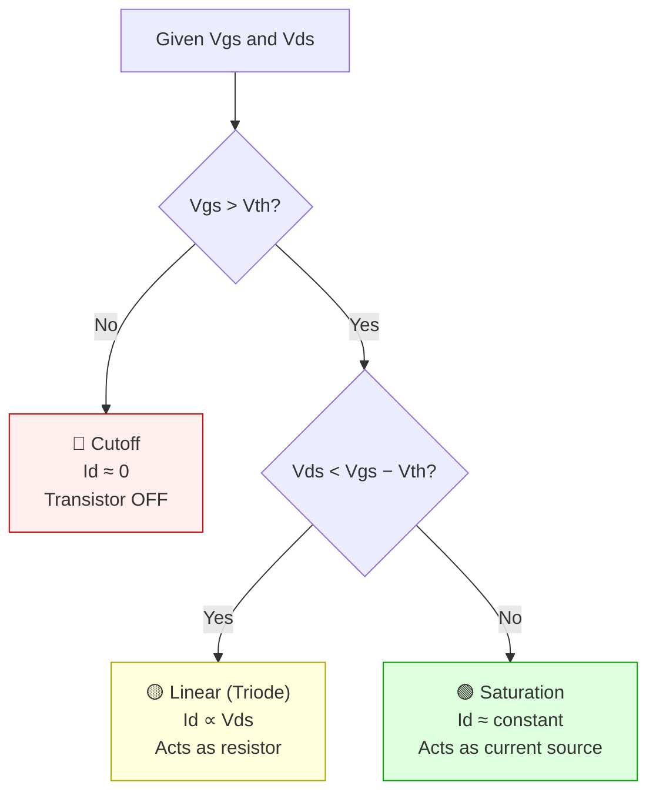
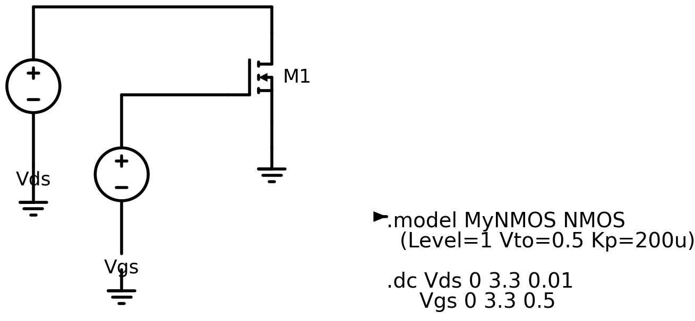
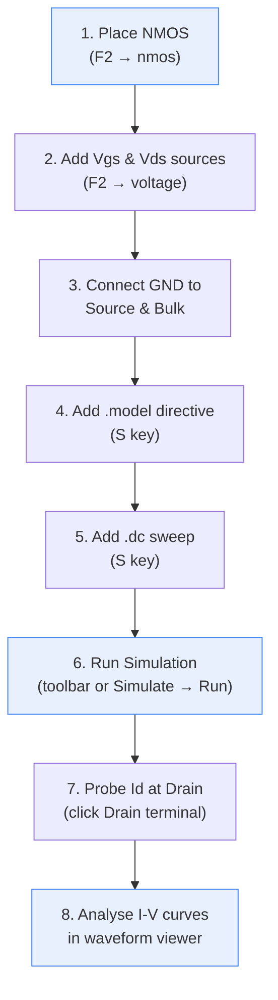
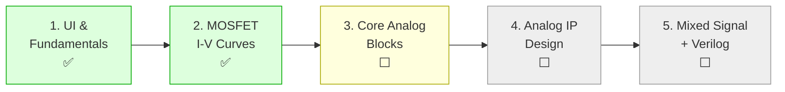

# MOSFET I-V Curves — DC Sweep in LTspice

## Goal
Plot drain current (Id) vs drain-source voltage (Vds) for multiple gate voltages (Vgs) to visualize the three MOSFET operating regions.

---

## MOSFET Operating Regions (Review)

| Region | Condition | Behaviour |
|--------|-----------|-----------|
| **Cutoff** | Vgs < Vth | Id ≈ 0, transistor is OFF |
| **Linear (Triode)** | Vgs > Vth, Vds < Vgs − Vth | Acts like a voltage-controlled resistor; Id rises with Vds |
| **Saturation** | Vgs > Vth, Vds ≥ Vgs − Vth | Id nearly constant for given Vgs; transistor acts as a current source |

### Key Equations (Level 1 ideal model)

**Linear region:**
```
Id = Kp × [(Vgs − Vth) × Vds − Vds²/2]
```

**Saturation region:**
```
Id = (Kp/2) × (Vgs − Vth)²
```

Where `Kp = μₙCₒₓ(W/L)` is the transconductance parameter.

### Region Decision Flowchart



---

## Circuit Setup

### Components needed
1. **NMOS transistor** — `F2` → search `nmos`
2. **Vgs source** — `F2` → search `voltage`, connect between Gate and GND
3. **Vds source** — `F2` → search `voltage`, connect between Drain and GND
4. **GND** — connect to Source and Bulk (Body)

### Schematic



### MOSFET model directive
Place on the schematic with `S`:
```spice
.model MyNMOS NMOS (Level=1 Vto=0.5 Kp=200u)
```
- `Vto=0.5` → threshold voltage = 0.5 V
- `Kp=200u` → transconductance parameter = 200 μA/V²

---

### Simulation Workflow



---

## DC Sweep Simulations

### Exercise 1 — Id vs Vds (output characteristics)

Sweep Vds while stepping Vgs to produce a family of curves.

**SPICE directive:**
```spice
.dc Vds 0 3.3 0.01 Vgs 0 3.3 0.5
```
- Primary sweep: Vds from 0 to 3.3 V, step 10 mV
- Nested sweep: Vgs from 0 to 3.3 V, step 0.5 V

**How to run:**
1. Place the `.dc` directive on the schematic (`S` key)
2. Press Run (toolbar button or **Simulate → Run**)
3. Click on the Drain terminal or the Vds source → plots Id vs Vds
4. You should see multiple curves, one per Vgs value

**What to observe:**
- Curves at low Vgs (below Vth = 0.5 V) are flat at zero → **cutoff**
- Each curve rises linearly at small Vds → **linear region**
- Each curve flattens at higher Vds → **saturation region**
- The boundary between linear and saturation follows Vds = Vgs − Vth

---

### Exercise 2 — Id vs Vgs (transfer characteristic)

Sweep Vgs at a fixed Vds to see the turn-on behaviour.

**SPICE directive:**
```spice
.dc Vgs 0 3.3 0.01
```
Set Vds to a constant value (e.g. 1.65 V) so the MOSFET stays in saturation.

**What to observe:**
- Id ≈ 0 when Vgs < Vth → **cutoff**
- Id increases as (Vgs − Vth)² above threshold → **saturation characteristic**
- The x-intercept of the curve gives you Vth

---

### Exercise 3 — Extract Vth from the transfer curve

1. Run Exercise 2
2. Right-click the waveform → **Add Cursor**
3. Move cursor along the curve to find where Id first becomes non-zero
4. That Vgs value ≈ Vth (should be ~0.5 V for our model)

---

## Useful Waveform Viewer Tips

| Action | How |
|--------|-----|
| Add a cursor | Right-click waveform → Add Cursor |
| Read values | Cursor readout appears at bottom of viewer |
| Add another trace | Right-click waveform → Add Trace |
| Zoom into a region | Click and drag on the plot |
| Fit all curves | `Space` |

---

## Common Mistakes

| Mistake | Fix |
|---------|-----|
| Bulk/Body terminal left floating | Connect Bulk to GND (for NMOS) |
| Model directive missing | Add `.model` line — without it, LTspice uses default params |
| Flat line at Id = 0 for all Vgs | Check that Vgs source is actually connected to the Gate |
| Only one curve instead of family | Use nested sweep syntax: `.dc Vds ... Vgs ...` |

---

## Summary

| What you learned | How |
|-----------------|-----|
| Three MOSFET operating regions | Observed in Id-Vds family of curves |
| DC sweep (`.dc`) | Single sweep and nested (two-source) sweep |
| Transfer characteristic | Id vs Vgs plot shows turn-on and Vth |
| Waveform probing | Click terminals to plot current/voltage |

---

## Study Roadmap



## Next Step
**Core Analog Building Blocks** — Start with the common-source amplifier, then move to differential pairs and current mirrors.
